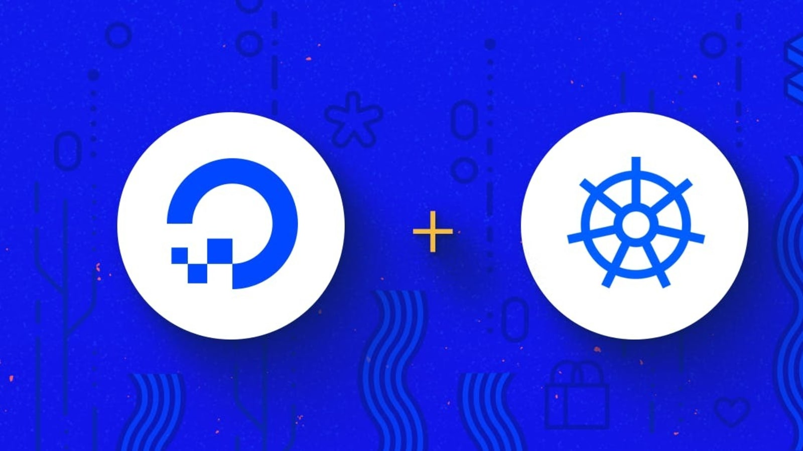

# DigitalOcean Kubernetes Challenge
This is my official submission for the [Digital Ocean Kubernetes Challenge](https://www.digitalocean.com/community/pages/kubernetes-challenge)! ✨



## Challenge: Deploy an internal container registry
Kubernetes does not provide an internal container registry but it is often useful to add one. There are many projects which enable you to deploy an internal container registry, such as Harbour or Trow.

## Blog Post
Find my Article on Medium [here](https://aaishika.medium.com/digitalocean-kubernetes-challenge-deploy-an-internal-container-registry-c7bf73a39387)! I've tried my level best to share all the details pertaining to my submission!

## Dependencies
 - Helm
  ``` bash
    brew install helm
  ```
 - Harbor
  ``` bash
      HARBORPASS=$(openssl rand -hex 8)
      echo $HARBORPASS
      HARBORKEY=$(openssl rand -hex 8)
      helm install \
      --namespace harbor \
      --create-namespace \
      --values charts/harbor/values.yml \
      --set-string "secretKey=$HARBORKEY" \
      --set-string "harborAdminPassword=$HARBORPASS" \
      harbor harbor/harbor
 ```   
 - Traefik
 ``` bash
    helm install \
    --namespace traefik \
    --create-namespace \
    --values charts/traefik/values.yml \
    traefik traefik/traefik
```
 - Nginx
 ``` bash
    kubectl apply -f yml/nginx-example.yml
```

## Learnings
1. Installing and understanding Traefik as an ingress.
2. Installing Harbor as an image repositpry.
3. Using DigitalOcean Kubernetes Service (DOKS).
4. Understanding the interface and insights offered by DigitalOcean.
5. Using Helm Charts to install packages and override values.
